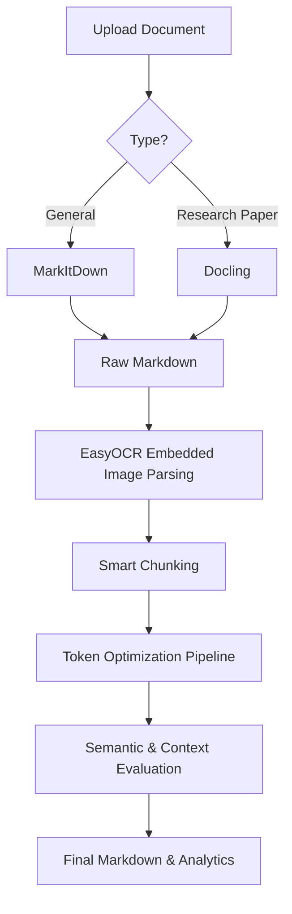

<div align="center">

# Mark-SaaS

**An open-source document optimization pipeline for LLMs.**

[](https://github.com/VoidCrewTech67/Mark-SaaS/stargazers)
[](https://opensource.org/licenses/MIT)

*A technical implementation to reduce LLM token usage while preserving document semantics and structure.*

</div>

---

## The Problem

Large Language Models and RAG pipelines struggle with raw documents (PDFs, DOCX). These files contain high amounts of noise: repeating headers, bloated tables, inline citations, and hidden layouts. Feeding this directly into an LLM wastes context windows, drives up API costs, and degrades retrieval accuracy.

## Solution Overview

**Mark-SaaS** is a middleware pipeline that cleans and compresses documents into high-fidelity Markdown before they reach your AI applications. We use specialized extractors, smart embedded OCR, and a multi-pass token optimization pipeline to aggressively reduce token count. We then score the output to ensure high semantic preservation and context retention.

---

## Extraction Modes

Our extraction layer routes documents based on their type and complexity:

| Mode | Extractor | Description |
|---|---|---|
| **General Documents** | MarkItDown | Fast, structural extraction for standard PDFs, DOCX, and presentations. |
| **Research Papers** | Docling | A specialized extraction pipeline designed for academic papers, technical reports, and structured research documents. Optimized for preserving headings, sections, tables, figures, and references. |
| **Embedded Images** | EasyOCR | Configurable OCR specifically for images embedded within documents, with heuristics to skip noise. |

---

## Key Features

- **Document Extraction:** Dedicated pathways for standard documents and complex research papers.
- **Embedded Image OCR:** Extracts text from images embedded in documents, with a "Smart" mode to skip logos and purely decorative elements.
- **Smart Chunking:** Slices optimized Markdown into overlapping, semantically whole chunks.
- **Token Optimization Pipeline:** A multi-pass filtering system that strips boilerplate, legal text, and citations, and minifies tables.
- **Semantic Preservation Scoring:** Uses bidirectional embedding comparisons to validate that the optimized text retains its original meaning.
- **Context Preservation Evaluation:** Structural analysis to ensure headers, code blocks, and named entities survive optimization.
- **Analytics:** Granular metrics on token savings and optimization efficiency per document.

---

## Architecture Overview

Our processing flow is designed around specialized stages:

* **General Documents** → MarkItDown
* **Research Papers** → Docling
* **Embedded Images** → EasyOCR
* **Smart Chunking** → **Optimization Pipeline** → **Evaluation**



---

## Project Structure

```text
Mark-SaaS/
├── backend/                  
│   ├── app/
│   │   ├── api/              # FastAPI REST endpoints
│   │   ├── optimizer/        # Token optimization passes
│   │   └── services/         # Extraction, OCR, and Scoring logic
│   └── tests/                # Pytest suite
├── frontend/                 
│   ├── app/                  # Next.js App Router
│   ├── components/           # React UI components
│   └── hooks/                # React state management
└── README.md                 
```

---

## Tech Stack

We use standard, reliable tools for our current production implementation:

**Frontend**
- Next.js
- React
- TypeScript
- Tailwind CSS

**Backend**
- FastAPI
- Python

**AI / Machine Learning**
- MarkItDown
- Docling
- EasyOCR
- Sentence-Transformers (`all-MiniLM-L6-v2`)

---

## Installation Guide

### 1. Clone the Repository
```bash
git clone https://github.com/VoidCrewTech67/Mark-SaaS.git
cd Mark-SaaS
```

### 2. Backend Setup
```bash
cd backend
python -m venv venv
source venv/bin/activate  # Or venv\Scripts\activate on Windows
pip install -r requirements.txt
cp .env.example .env
uvicorn app.main:app --reload --port 8000
```

### 3. Frontend Setup
```bash
cd ../frontend
npm install
npm run dev
```
The UI runs at `http://localhost:3000`.

---

## Usage Guide

1. **Upload:** Drag and drop your documents (or ZIP archives) into the UI.
2. **Configure:** Select "General Document" or "Research Paper" mode, and choose your optimization aggressiveness.
3. **Process:** The system runs extraction, chunking, optimization, and evaluation.
4. **Analyze & Export:** Review the token reduction metrics and semantic preservation scores, then download the optimized Markdown.

---

## Evaluation Metrics

- **Semantic Preservation Score:** Embeddings comparison to measure meaning retention.
- **Context Preservation Score:** Validates structural element retention (tables, lists, entities).
- **Token Reduction %:** The percentage of LLM tokens saved by the optimization pipeline.
- **Quality Trade-offs:** Potential context dropped based on the chosen optimization level.

---

## Current Limitations

We believe in being transparent about what the system cannot do:
- **Legacy PDFs:** Some legacy PDFs cannot be extracted because they contain neither selectable text nor image layers suitable for OCR. Such files currently remain unsupported.
- **Poor Scans:** Degraded, low-DPI scans will result in poor OCR accuracy.
- **Complex Layouts:** Highly irregular magazine-style layouts may still present reading-order challenges.

---

## Screenshots

| Dashboard View | Upload & Configuration | Analytics & Results |
|:---:|:---:|:---:|
|  |  |  |

---

## Contributing

1. Fork the repository
2. Create a feature branch
3. Commit your changes
4. Push and open a Pull Request

---

## License

Distributed under the MIT License.

---

## Acknowledgements

- [Microsoft MarkItDown](https://github.com/microsoft/markitdown)
- [IBM Docling](https://github.com/DS4SD/docling)
- [EasyOCR](https://github.com/JaidedAI/EasyOCR)
- [Sentence-Transformers](https://sbert.net/)
