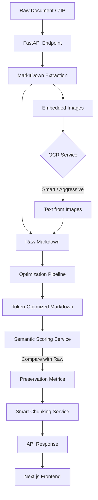

# MarkItDown Converter

A production-grade, local-first application designed to convert various document formats (PDF, DOCX, PPTX, etc.) into clean, AI-ready Markdown.

Powered by Microsoft's MarkItDown library, this application solves the challenge of feeding raw, messy documents into Large Language Models (LLMs). Raw document conversions often contain noisy headers, repetitive boilerplate, unextracted images, and bloated tables that consume valuable LLM context windows and degrade inference quality. This tool provides a robust pipeline involving OCR, advanced token optimization, smart chunking, and semantic preservation scoring to ensure your LLMs receive the most context-dense and accurate Markdown possible.

---

## ⚡ Features

### Microsoft MarkItDown Conversion
The core engine uses Microsoft's `markitdown` Python library to parse complex document structures (DOCX, PPTX, XLSX, HTML, PDFs) into base Markdown. This provides a highly accurate structural extraction before our custom optimization pipeline takes over.

### Embedded Image OCR
Many documents contain critical information trapped in embedded images (like scanned charts or diagrams). Our pipeline automatically extracts these images and runs OCR (Optical Character Recognition) using `EasyOCR`.
- **Why it exists:** LLMs (unless using Vision models) cannot read images.
- **When it is used:** Configurable via three modes:
  - **Disabled:** Fastest, skips all images.
  - **Smart (Recommended):** Uses heuristics to filter out logos, UI icons, and decorative noise, running OCR only on meaningful content.
  - **Aggressive:** Scans every single extracted image.

### Token Optimization
A sophisticated multi-pass pipeline that aggressively reduces the token count of the output Markdown without losing core meaning.
- **Why it exists:** LLM context windows are limited and expensive. Bloated documents slow down inference.
- **When it is used:** Automatically applied after conversion. It removes boilerplate, compresses tables, resolves citations, and deduplicates paragraphs.

### Semantic Preservation Validation
After token optimization, the system validates that the optimization didn't destroy meaning. It uses a three-score architecture:
1. **Semantic Preservation:** Uses `sentence-transformers` (`all-MiniLM-L6-v2`) to perform bidirectional chunk recall, ensuring high semantic similarity.
2. **Context Preservation:** Structural analysis ensuring headers, tables, numbers, code blocks, images, and named entities survive the optimization.
3. **Overall Score:** A harmonic mean of both scores, displayed in the UI with severity indicators (🟢 Excellent to 🔴 Loss).

### Smart Chunking
Splits large, optimized Markdown documents into smaller, overlapping chunks based on specific token limits.
- **Why it exists:** RAG (Retrieval-Augmented Generation) architectures require small, semantically whole chunks rather than massive 100k-token files.
- **When it is used:** Users can select presets (4K, 8K, 16K tokens) or define custom sizes with customizable overlap percentages.

### ZIP Upload Processing
Upload a single ZIP file containing hundreds of documents.
- **What it does:** The backend extracts the archive and processes every supported document independently.
- **Why it exists:** For bulk processing of massive document repositories. Supports up to 500MB per ZIP and up to 1000 files simultaneously.

### Download System
Outputs can be downloaded individually as `.md` files, or chunked outputs can be downloaded as a structured ZIP archive. A "Download All" feature allows exporting all successfully processed documents at once.

---

## 🏗 Project Architecture

### Data Flow



### Component Stack
- **Frontend:** Next.js 16 (App Router), React 19, Tailwind CSS 4.
- **Backend:** FastAPI, Python 3.12.
- **ML / AI:** `sentence-transformers` (`all-MiniLM-L6-v2`), `EasyOCR`.
- **State Management:** Custom React Hook (`useConversion`).

---

## 📂 Folder Structure

### Backend (`/backend`)
The FastAPI application core.

- **`app/main.py`**
  The entry point. Initializes FastAPI, sets up CORS, mounts the lifecycle (startup OCR warmups, cleanup tasks), and registers routers.
- **`app/api/routes/`**
  REST API endpoints.
  - `convert.py`: Handles single-file conversion orchestration.
  - `zip_upload.py`: Handles bulk ZIP expansion and dispatch.
  - `chunk.py`: Dedicated endpoint for generating chunks from existing files.
  - `stats.py`, `health.py`, `download.py`: Utilities.
- **`app/services/`**
  The business logic layer.
  - `conversion_service.py`: Orchestrates the pipeline (MarkItDown -> OCR -> Optimize).
  - `optimization_service.py`: Async wrapper around the optimizer framework.
  - `ocr_service.py`: Manages the `EasyOCR` singleton, smart heuristics, and caching.
  - `semantic_scoring.py`: Computes the 3-score semantic preservation metrics.
  - `cleanup_service.py`: Background TTL-based garbage collection for stateless uploads.
- **`app/models/`**
  Pydantic models for API request/response validation (e.g., `OptimizationStatsResponse`).
- **`app/optimizer/`**
  The custom token optimization framework. See the **Optimizer Framework** section below.
- **`tests/`**
  Pytest suite. Includes comprehensive tests for components like `semantic_scoring.py`.

### Frontend (`/frontend`)
The Next.js 16 user interface.

- **`app/`**
  Next.js App Router root. Contains `page.js` (main dashboard) and `globals.css` (custom Tailwind design system).
- **`components/`**
  React components.
  - `ResultCard.jsx`: The complex expandable card showing metrics, code previews, tabs, and semantic badges.
  - `UploadZone.jsx`: Drag-and-drop zone handling staging and bulk triggers.
  - `Sidebar.jsx`, `Navbar.jsx`: Application shell.
- **`hooks/`**
  - `useConversion.js`: Massive custom hook managing the entire state machine (idle -> uploading -> converting -> done) and ZIP expansion mapping.
- **`services/api.js`**
  Axios wrapper for communicating with the FastAPI backend.

---

## ⚙️ Optimizer Framework

Located in `backend/app/optimizer/`, this is a highly modular framework that passes the Markdown through sequential filters to reduce token count.

### Architecture
- **`OptimizerPass`**: Base abstract class for all passes.
- **`PipelineExecutor`**: Orchestrates the sequential execution of registered passes.
- **`OptimizationReport`**: Aggregates token savings and metadata per pass.

### Registered Passes (`optimizer/passes/`)

| Pass Name | Purpose |
|---|---|
| `header_footer.py` | Detects and removes repeating page headers, footers, and page numbers. |
| `reference_section.py` | Detects "References" or "Bibliography" sections and strips them. Highly effective for academic papers. |
| `citation.py` | Removes inline citations (e.g., `[1]`, `(Smith, 2020)`) to clean up narrative text. |
| `boilerplate_section.py` | Strips legal disclaimers, copyright notices, and generic table of contents. |
| `paragraph_dedup.py` | Global deduplication. Removes paragraphs that are identical or highly similar across the document. |
| `table_compression.py` | Converts bloated Markdown tables into dense, pipe-delimited HTML or minified structures, dropping empty columns. |
| `abbreviation_mining.py` | Replaces long phrases with their acronyms after the first definition (e.g., "Large Language Model (LLM)" -> "LLM"). |
| `semantic_dedup.py` | Uses embeddings to find and merge semantically identical paragraphs that have slight lexical differences. |
| `ocr_cleanup.py` | Fixes broken lines, hyphenated words, and weird spacing artifacts introduced by the OCR engine. |

**Benefits:** Can reduce document token footprint by 20-40% without losing facts.
**Risks:** Aggressive deduplication or reference removal might drop context needed for highly specific academic queries. Semantic scoring mitigates this risk by flagging heavy losses.

---

## 📡 API Documentation

Base URL: `http://localhost:8000/api`

### `POST /upload`
Uploads a single file. Returns an opaque `file_id`.
**Response:** `{"file_id": "uuid", "original_name": "doc.pdf", "size_bytes": 1024}`

### `POST /zip-upload`
Uploads a ZIP archive. Expands it and returns independent file IDs.
**Response:** `{"files": [{"file_id": "...", "filename": "a.pdf"}, ...]}`

### `POST /convert`
Triggers the conversion pipeline for a given `file_id`.
**Payload:** `{"file_id": "uuid", "ocr_mode": "smart", "optimize": true}`
**Response:** `ConversionResponse` (contains `markdown`, `optimized_markdown`, `optimization_stats`).

### `POST /convert/batch`
Batch processes multiple `file_id`s concurrently.

### `POST /chunk`
Generates chunks from an already converted `file_id`.
**Payload:** `{"file_id": "uuid", "max_tokens": 4000, "overlap_percent": 10, "source": "optimized"}`

---

## 🧪 Testing

The backend includes a comprehensive `pytest` suite.
- **Coverage:** High coverage on the `optimizer` framework and `semantic_scoring` service.
- **Execution:**
  ```bash
  cd backend
  pytest tests/
  ```

---

## 🚀 Deployment

### Backend (FastAPI on Render)
Configured via `render.yaml`.
- **Environment:** Python 3.12
- **Command:** `uvicorn app.main:app --host 0.0.0.0 --port $PORT`
- **Env Vars:** `ALLOWED_ORIGINS` (points to frontend URL).

### Frontend (Next.js on Vercel)
Configured via `vercel.json` and standard Next.js build pipes.
- **Environment:** Node.js 20+
- **Build:** `npm run build`
- **Env Vars:** `NEXT_PUBLIC_API_URL` (points to Render URL).

---

## 🗺 Roadmap

### Current
- ✅ Microsoft MarkItDown extraction
- ✅ Smart Embedded Image OCR
- ✅ Modular Token Optimization Pipeline
- ✅ Three-Score Semantic Preservation Validation
- ✅ Batch / ZIP Processing

### Planned
- ⏳ User Authentication (Clerk/NextAuth)
- ⏳ Personal conversion history & cloud storage

### Future
- 🔮 Native GPU-accelerated OCR nodes
- 🔮 Browser Extension for instant webpage to Markdown conversion
- 🔮 Direct MCP (Model Context Protocol) Server integration
